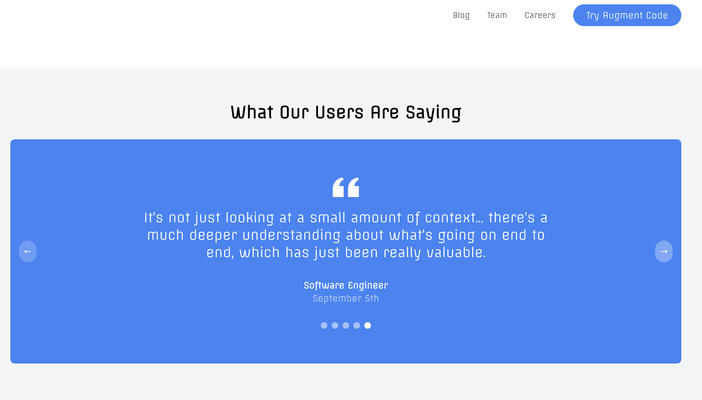

# Augment Codes

This is the landing page conceptfor Augment Code, an AI code generation developer tool for enterprise engineering teams.

Augment's understanding of your codebase and dependencies removes the toil in your day, so you can experience the joy of coding.

## Features

- Landing page with interactive hero section featuring a blinking robot animation on hover
- User testimonials carousel

## Getting Started

These instructions will get you a copy of the project up and running on your local machine for development and testing purposes.

### Installation

1. Clone the repository:
   ```
   git clone https://github.com/yourusername/augment-codes.git
   ```

2. Navigate to the project directory:
   ```
   cd augment-codes
   ```

3. Install dependencies:
   ```
   npm install
   ```

4. Start the development server:
   ```
   npm run dev
   ```

5. Open [http://localhost:3000](http://localhost:3000) in your browser to view the application.

## Built With

- [Next.js](https://nextjs.org/) - The React framework used
- [Tailwind CSS](https://tailwindcss.com/) - For styling
- [TypeScript](https://www.typescriptlang.org/) - For type-safe code

## License

This project is licensed under the MIT License - see the [LICENSE.md](LICENSE.md) file for details

## Acknowledgments

- This project is a clone of the [Augment Code](https://www.augmentcode.com/) website, created for educational purposes and to showcase web development skills.
- The original design and concept belong to Augment Code.
- Additional features, modifications, and improvements are my own work.
- This project is not affiliated with or endorsed by Augment Code.

## Screenshots

### Landing Page




